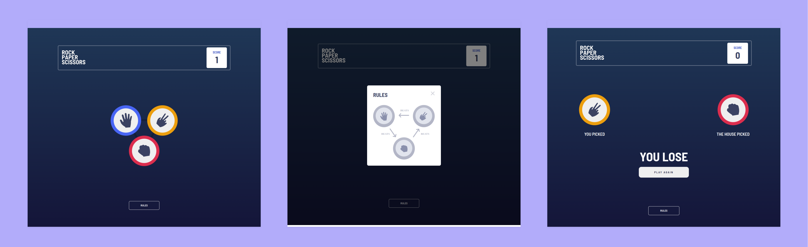

# rock-paper-scissors ✊🧾✂

### O clássico jogo de pedra papel e tesoura. Este projeito foi feito com o intuito de estudar/implementar teste unitários.

## 



## 🚀 | Tecnologias

- React;
- Typescript;
- Jest;
- React Testing Library;
- SASS.

## 🏃 | Como rodar

### Clone o repositório:

```bash
git clone https://github.com/johelder/rock-paper-scissors.git
```

### Instale as dependências do projeto:

```bash
yarn
```

### Rode o projeto localmente:

```bash
yarn dev
```

---

<p style="text-align:center">Com 💜 por Johelder</p>
